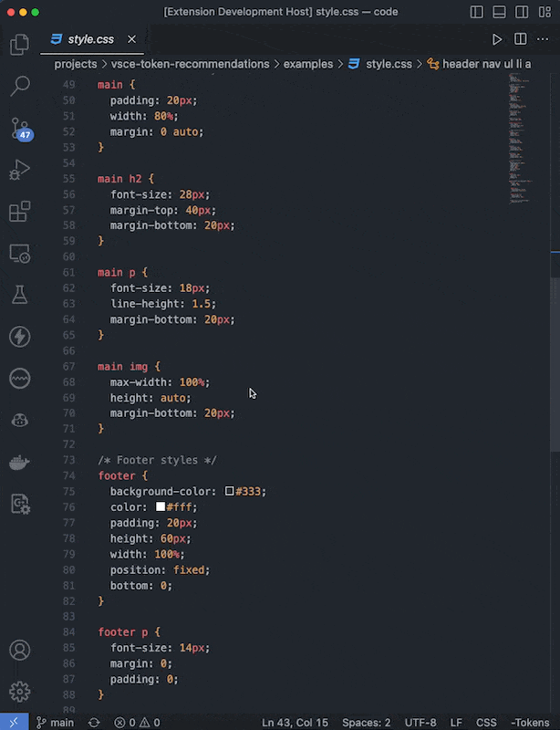
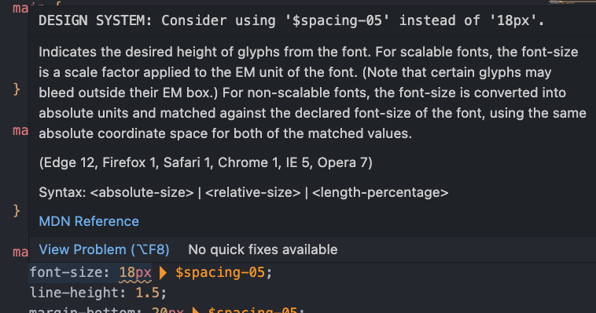
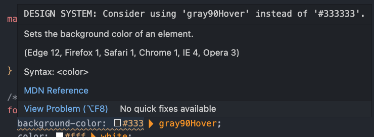
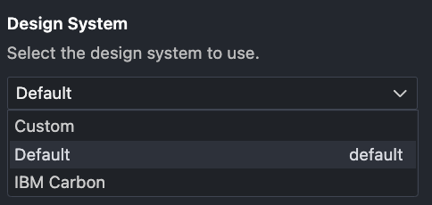
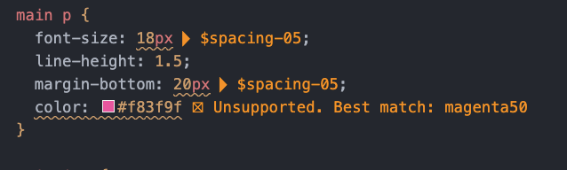

# Design System Linter

Design System Linter is a powerful VSCode extension that helps you maintain consistency and adhere to your design system guidelines while coding. By providing visual cues and warning messages for correct token usage, this extension eliminates the need to constantly consult your design system documentation, thereby enhancing your productivity.

# Images
## Demo

## Linter
### Spacing Tokens

### Color Tokens


# Features

## Design System Selection

Design System Linter allows you to choose between built-in design systems or use a custom design system.

To change the design system:
1. Option 1: Open your VS Code Preferences and navigate to `Extensions` > `Design System Linter` > `Design System`. Once here, select the design system you would like to use.
2. Option 2: Manually update the `designSystem` option in your `settings.json` file. The available options are:

- "Default": The built-in default design system
- "IBM Carbon": The IBM Carbon Design System
- "Custom": Use a custom design system defined in your `settings.json`



## Token Warnings

If a hex color is used that cannot be found in the default (or overridden) tokens, the following message will be displayed: "⛝ Unsupported. Best match: ${nearestToken}"



# Getting Started

1. **Installation**: Install the `Design System Linter` extension from the VSCode marketplace.
2. **Enable/Disable**: The extension is enabled by default. To toggle its functionality, click the "Tokens" button in the status bar.
3. **Configuration**: Navigate to `Preferences` > `Extensions` > `Design System Linter` to select a design system or custom option.
4. **Custom tokens**: To use custom tokens, update the `design-system-linter.customSpacingTokens` and `design-system-linter.customColorTokens` options in your `settings.json` file.

# Design System Selection and Custom Options
To use a different design system or define custom tokens, follow these steps:

1. Navigate to `Preferences` > `Extensions` > `Design System Linter`.
2. Under the "Design System" option, select one of the predefined design systems or choose "Custom".
3. If you selected "Custom", click "Edit in settings.json" next to the custom token options.
4. Define your custom tokens in the settings.json file using the following format:

```json
  "design-system-linter.customSpacingTokens": [
    ["$spacing-1", 4],
    ["$spacing-2", 8],
    ["$spacing-3", 12],
    ["$spacing-4", 16],
    // ... other tokens
  ],
  "design-system-linter.customColorTokens": [
    ["$color-primary", "#1E90FF"],
    ["$color-secondary", "#FF7F50"],
    ["$color-success", "#32CD32"],
    ["$color-warning", "#FFA07A"],
    // ... other tokens
  ]
```

## Default Spacing Tokens

| Token                | Value     |
|----------------------|-----------|
| $size-spacing-0      | 0rem      |
| $size-spacing-1      | 0.25rem   |
| $size-spacing-2      | 0.5rem    |
| $size-spacing-3      | 0.75rem   |
| $size-spacing-4      | 1rem      |
| $size-spacing-5      | 1.25rem   |
| $size-spacing-6      | 1.5rem    |
| $size-spacing-7      | 1.75rem   |
| $size-spacing-8      | 2rem      |
| $size-spacing-9      | 2.25rem   |
| $size-spacing-10     | 2.5rem    |
| $size-spacing-11     | 2.75rem   |
| $size-spacing-12     | 3rem      |
| $size-spacing-14     | 3.5rem    |
| $size-spacing-16     | 4rem      |
| $size-spacing-20     | 5rem      |
| $size-spacing-24     | 6rem      |
| $size-spacing-28     | 7rem      |
| $size-spacing-32     | 8rem      |
| $size-spacing-36     | 9rem      |
| $size-spacing-40     | 10rem     |
| $size-spacing-44     | 11rem     |
| $size-spacing-48     | 12rem     |
| $size-spacing-52     | 13rem     |
| $size-spacing-56     | 14rem     |
| $size-spacing-60     | 15rem     |
| $size-spacing-64     | 16rem     |
| $size-spacing-72     | 18rem     |
| $size-spacing-80     | 20rem     |
| $size-spacing-96     | 24rem     |
| $size-spacing-px     | 0.0625rem |
| $size-spacing-0-5    | 0.125rem  |
| $breakpoint-md       | 37.5rem   |
| $breakpoint-lg       | 56.563rem |
| $breakpoint-xl       | 77.5rem   |

## Default Color Tokens
| Token                                        | Value     |
|----------------------------------------------|-----------|
| $color-base-gray-100                         | "#f2f2f2" |
| $color-base-gray-200                         | "#e0e0e0" |
| $color-base-gray-300                         | "#a8a8a8" |
| $color-base-gray-400                         | "#8d8d8d" |
| $color-base-gray-500                         | "#6f6f6f" |
| $color-base-gray-600                         | "#525252" |
| $color-base-gray-700                         | "#363534" |
| $color-base-orange-300                       | "#f68c2c" |
| $color-base-orange-900                       | "#bc5801" |
| $color-base-white                            | "#ffffff" |
| $color-border-base                           | "#363534" |
| $color-border-focus                          | "#363534" |
| $color-border-inverse-base                   | "#ffffff" |
| $color-border-inverse-focus                  | "#ffffff" |
| $color-border-button-outline                 | "#363534" |
| $color-border-button-inverse-outline         | "#ffffff" |
| $color-brand-background                      | "#ffffff" |
| $color-brand-primary-base                    | "#363534" |
| $color-brand-primary-hover                   | "#525252" |
| $color-brand-primary-active                  | "#6f6f6f" |
| $color-brand-primary-disabled                | "#a8a8a8" |
| $color-brand-surface-base                    | "#f2f2f2" |
| $color-brand-surface-hover                   | "#e0e0e0" |
| $color-brand-surface-active                  | "#a8a8a8" |
| $color-brand-surface-disabled                | "#a8a8a8" |
| $color-brand-on-primary                      | "#ffffff" |
| $color-brand-on-surface                      | "#363534" |
| $color-brand-on-background-base              | "#363534" |
| $color-brand-on-background-variant           | "#6f6f6f" |
| $color-brand-inverse-background              | "#363534" |
| $color-brand-inverse-primary-base            | "#ffffff" |
| $color-brand-inverse-primary-hover           | "#f2f2f2" |
| $color-brand-inverse-primary-active          | "#e0e0e0" |
| $color-brand-inverse-primary-disabled        | "#a8a8a8" |
| $color-brand-inverse-surface-base            | "#525252" |
| $color-brand-inverse-surface-hover           | "#6f6f6f" |
| $color-brand-inverse-surface-active          | "#8d8d8d" |
| $color-brand-inverse-surface-disabled        | "#a8a8a8" |
| $color-brand-inverse-on-primary              | "#363534" |
| $color-brand-inverse-on-surface              | "#ffffff" |
| $color-brand-inverse-on-background-base      | "#ffffff" |
| $color-brand-inverse-on-background-variant   | "#a8a8a8" |
| $color-brand-support-informational           | "#363534" |
| $color-brand-support-error                   | "#f4d8da" |
| $color-brand-support-warning                 | "#ffdd99" |
| $color-brand-support-success                 | "#000000" |
| $color-brand-support-on-informational        | "#ffffff" |
| $color-brand-support-on-error                | "#b10009" |
| $color-brand-support-on-warning              | "#363534" |
| $color-brand-support-on-success              | "#000000" |
| $color-font-button-primary                   | "#ffffff" |
| $color-font-button-outline                   | "#363534" |
| $color-font-button-ghost                     | "#363534" |
| $color-font-button-disabled                  | "#363534" |
| $color-font-button-inverse-primary           | "#363534" |
| $color-font-button-inverse-outline           | "#ffffff" |
| $color-font-button-inverse-ghost             | "#ffffff" |
| $color-support-error-base                    | "#b10009" |
| $color-support-error-light                   | "#f4d8da" |
| $color-support-warning-base                  | "#ffdd99" |
| $color-support-warning-light                 | "#ffeecc" |
| $color-support-success-base                  | "#006600" |
| $color-support-success-light                 | "#d8ecb6" |

# Known Issues

There are currently no known issues.
